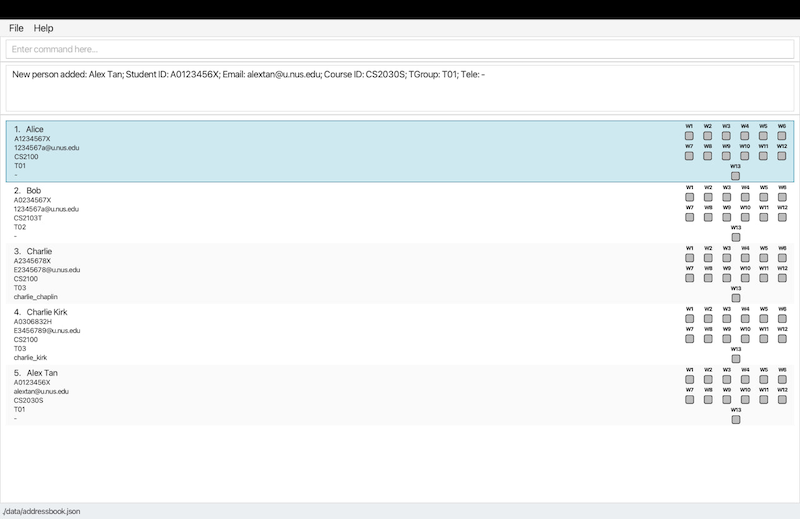

# TeachAssist User Guide

Are you tired of juggling multiple platforms—tracking tutorials, managing attendance and progress, and keeping track of endless student records? Do you find yourself struggling with clunky spreadsheets and endless menus? TeachAssist is for you.

TeachAssist is a desktop application designed for full-time University Teaching Assistants (TAs) at NUS who manage multiple classes and tutorials each semester.If you're a fast typist, TeachAssist can help you quickly filter student lists, track attendance, and log important notes using straightforward keyboard commands, all while offering an easy-to-navigate visual interface.

And the best part? No technical expertise needed—just basic computer skills like installing software and navigating files.

## Table of contents
- [Quick Start](#quick-start)
- [Features](#features)
  - [Viewing help: `help`](#help)
  - [Listing all students `list`](#list)
  - [Adding a student: `add`](#add)
  - [Deleting a student: `delete`](#delete)
    - [Delete by index](#deletebyindex)
    - [Delete by student details](#deletebydetails)
  - [Clearing all contacts: `clear`](#clear)
  - [Finding a student: `find`](#finding-students-by-name-find)
  - [Filtering students: `filter`](#filter)
  - [Editing a student: `edit`](#edit)
  - [Viewing a student: `view`](#view)
  - [Marking a student's attendance: `markattendance`](#mark-attendance)
  - [Updating a student's progress: `updateprogress`](#update-progress)
  - [Adding a remark: `remark`](#remark)
  - [Deleting a remark: `unremark`](#unremark)
  - [Exiting the app](#exit)
- [Command Summary](#command-summary)
- [Parameter Summary](#parameter-summary)
- [FAQ](#faq)

---
## Quick start

1. Ensure you have **Java 17** or above install on your computer.<br>
> **Checking your Java version**
> - Open a command terminal on your computer.
> - Type `java -version` and press Enter.
> - If Java is installed, you will be shown the version number (e.g. `java version 17.0.1`).
> - The first number should be 17 or higher.
>
> **If Java is not installed, or the version number is below 17:**
> - Download and install Java 17 by following the guide:
    >   - [for Windows users](https://se-education.org/guides/tutorials/javaInstallationWindows.html) [for Mac users](https://se-education.org/guides/tutorials/javaInstallationMac.html) [for Linux users](https://se-education.org/guides/tutorials/javaInstallationLinux.html)
> - After installation, restart your terminal and check that the correct version has been installed.

2. Download the latest `TeachAssist.jar` file from [here](https://github.com/AY2526S2-CS2103T-F10-3/tp/releases/tag/v1.3)
3. Copy the `TeachAssist.jar` file to the folder you want to use as the _home folder_ for your LambdaLab.
4. Open the command terminal again and do the following:
    - Type `cd name-of-your-home-folder` and press Enter.
    - Type `java -jar TeachAssist.jar` and press Enter to run the application.
      A GUI similar to the below should appear in a few seconds. Note how the app contains some sample data.<br>
      

5. Type the command in the command box and press Enter to execute it. e.g. typing `help` and pressing Enter will open the help window.<br>
   Some example commands you can try:
    - `help` : Shows the help window that explains the command usage.
    - `list` : Lists all students.
    - `delete 3`: Deletes the student at the current list's index 3.
    - `add n/John Doe id/A0123456X e/johnd@u.nus.edu.com crs/CS2103T tg/T01 tel/@johndoe`: Adds a student named `John Doe`.
    - `clear`: Deletes all students.
    - `exit`: Exits the app.

6. Refer to the [Features](#features) below for details of each command.

---

## Features

<a name="help"></a>
### Viewing help : `help`

If you ever need a quick refresher on TeachAssist features, the Help Window provides a summary of all commands and a direct link to the User Guide.


Format:
```
help
```
Tip: You can also press F1 to open the Help window.

## 

<a name="list"></a>
### Listing all students: `list`

Lists all students stored sorted in ascending order

Format:
```
list
```

##

<a name="add"></a>
### Adding a student: `add`

Adds a student. The TELEGRAM_USERNAME field is optional.

Format:
```
add n\NAME id/STUDENT_ID e/EMAIL crs/COURSE_ID tg/TUTORIAL_GROUP [tel/TELEGRAM_USERNAME]
```

Examples:
```
add n/JOHN DOE id/A0123456X e/johnd@u.nus.edu crs/CS2103T tg/T01 tel/@JOHNDOE
```

##

<a name="delete"></a>
### Deleting a student : `delete`

Deletes a student by INDEX or by student details.

<a name="deletebyindex"></a>
**Delete by index**

Format:
```
delete INDEX
```

* Deletes the student at the specified `INDEX`.
* The index refers to the index number shown in the currently displayed student list.
* The index **must be a positive integer** 1, 2, 3, …

<a name="deletebydetails"></a>
**Delete by student details**

Format:
```
delete id/STUDENT_ID crs/COURSE_ID tg/TUTORIAL_GROUP
```

* Deletes the student with the exact details match for `STUDENT_ID`, `COURSE_ID`, and `TUTORIAL_GROUP`.

**Confirmation prompt**

After entering a valid `delete` command, TeachAssist will show a confirmation pop-up.<br>
Enter `yes` to proceed with the deletion, or `no` to cancel it.

**Examples**:

`delete 1` followed by `yes`
* Deletes the 1st student in the currently displayed student list.

`delete id/A1234567X crs/CS2103T tg/T01` followed by `yes`
* Deletes the student with student ID A1234567X, course CS2103T, and tutorial group T01.

`delete 3` followed by `no`
* No change is made.

##

<a name="clear"></a>
### Clears all students : `clear`

Deletes all students

Format:
```
clear
```

##

<a name="find"></a>
### Finding students by name: `find`

Instantly locate students by typing the beginning of any word in their name.

Format: `find KEYWORD [MORE_KEYWORDS]...`

**Search Rules:**
* The search is case-insensitive. e.g. `hans` matches `Hans`
* The order of keywords does not matter. e.g. `Hans Bo` matches `Bo Hans`
* Only the name field is searched
* Keywords match the **start of words** in names (prefix matching).Substrings in the middle of words are not matched.
    * e.g. `Han` matches `Hans`
    * `an` will not match `Hans`
* If you provide multiple keywords, TeachAssist will find students that match any of them (e.g., find Al Bob finds both Albert and Bobby)

**Example:** `find jo doe` — Finds **Jo**hn **Doe** and **Jo**anne **Doe**bertson.

**Expected Output:**
The student list updates instantly to show only matching records, and the Result Box (see Figure X) displays the total count of students found.

<box type="warning">
Warning: Keywords must be **alphabetic only** (A–Z). Using numbers or symbols (e.g., `find A123`) will result in an error.
</box>

**Note:** The `find` command searches through the entire stored student list and replaces any existing filter — it does not apply on top of a previously displayed (filtered) list.

##

<a name="filter"></a>
### Filtering students: `filter`

Narrow down your student list by Course ID, Tutorial Group, Progress, or Absence count. This is the most efficient way to identify "at-risk" students or specific tutorial sections.

Format:
```
filter [crs/COURSE_ID] [tg/TUTORIAL_GROUP] [p/PROGRESS] [abs/ABSENCE_COUNT]`
```

Behaviour:
* Course ID (`crs/`) and tutorial group (`tg/`) are matched case-insensitively.
* Progress (`p/`) must be one of the supported tokens(case insensitive): `on_track`, `needs_attention`, `at_risk`, or `clear` (alias `not_set`).
* Absence count (`abs/`) matches students whose absence count is greater than or equal to the provided number.
* Multiple filters combine with AND semantics — a student must satisfy every provided filter to be included in the results.

**Warning:**At least one filter parameter must be provided; using no parameters will result in an error.
** Note:** the `filter` command applies to the entire stored student list and replaces any existing filter — it does not apply on top of a previously displayed (filtered) list.

Examples:
* `filter crs/CS2103T` — returns students enrolled in CS2103T.
* `filter crs/CS2103T tg/T01` — returns students in CS2103T and tutorial group T01.
* `filter p/on_track` — returns students whose progress is `on_track`.
* `filter abs/2` — returns students with 2 or more absences.
* `filter crs/CS2103T tg/T02 p/needs_attention abs/1` — returns students matching all four criteria.

**Examples:**

filter crs/CS2103T — Returns all students enrolled in CS2103T.

filter crs/CS2103T tg/T01 — Returns students in CS2103T and tutorial group T01.

filter abs/2 — Returns students with 2 or more absences.

filter crs/CS2103T tg/T02 p/needs_attention abs/1 — Returns students matching all four criteria.

**Expected Output:**
The student list updates instantly. The Result Box will display the total count:

`There are 5 students matching this filter.`

**Tip:** if a filter returns no results, verify you used the correct course ID/tutor group format and valid progress values; run `help` or check the Update Progress section for exact progress tokens.

##

<a name="edit"></a>
### Editing a student: `edit`

Edit fields of the students at the given index. At least one field to edit must be provided.

Format:
```
edit INDEX [n/NAME] [id/STUDENT_ID] [e/EMAIL] [crs/COURSE_ID] [tg/TUTORIAL_GROUP] [tel/TELEGRAM_USERNAME]
```

Examples:
* `edit 1 n/John Tan` - Edits the name of the 1st student to `John Tan`.
* `edit 2 e1384397@u.nus.edu` - Edits the email of the 2nd student.
* `edit 3 tel/@john_tan` - Edits the Telegram username of the 3rd student.
* `edit 4 crs/CS2103T tg/T03` - Edits the course ID and tutorial group of the 4th student.
* `edit 5 n/John Tan e1384397@u.nus.edu` - Edits the name and email of the 5th student.
* `edit 6 id/A1234567B crs/CS2040S tg/T12` - Edits the student ID, course ID, and tutorial group of the 6th student.
* `edit 7 n/John Tan id/A1234567B e1384397@u.nus.edu crs/CS2105 tg/T08 tel/@john_tan` - Edits all editable fields of the 7th student.

##

<a name="view"></a>
### Viewing a student: `view`

If you need to see a student's remarks history, use the view command to display their information in the side panel.

Format:
```
view INDEX
```
**Example:** `view 1` — Displays the full details of the first student in the list.

**Expected Output:**
The **View Window** on the right side of the application updates to show the selected student's details. A confirmation message also appears in the Result Box:
> `Viewing student: John Doe; ID: A0123456X; ...`

**Note** The `view` command works on the *currently filtered* list. If you have filtered the list to show only "At Risk" students, `view 1` will show the first student in that filtered sub-list.

<box type="warning">
**Warning:** If the index provided is larger than the number of students currently visible (e.g., typing `view 10` when only 5 students are listed), TeachAssist will show an "Invalid index" error.
</box>

##

<a name="mark-attendance"></a>
### Marks a students attendance: `markattendance`

Updates attendance using the given week and status

Format:
```
markattendance INDEX week/WEEK_NUMBER sta/STATUS
```

* Supported attendance status values:
    * `y` --> Present  --> Green
    * `a` --> Absent   --> Red
    * `n` --> Undetermined   --> Grey

Examples:
```
markattendance 1 week/1 sta/y
```

##

<a name="update-progress"></a>
### Updating a student's progress : `updateprogress`

Updates a student's progress.

Format:
```
updateprogress INDEX p/PROGRESS
```

* Supported progress values:
  * `on_track`
  * `needs_attention`
  * `at_risk`
  * `not_set` (alias: `clear`)

* Parsing is case-insensitive (e.g `ON_TRACK` and `on_track` are both accepted)
* To remove a progress tag use `not_set` or `clear`.

Examples:
```
updateprogress 1 p/on_track
```

<a name="progressbydetails"></a>
**Update progress by student details**

Format:
```
updateprogress id/STUDENT_ID crs/COURSE_ID tg/TUTORIAL_GROUP p/PROGRESS
```

* Updates the progress of the student with the exact details match for `STUDENT_ID`, `COURSE_ID`, and `TUTORIAL_GROUP` to `PROGRESS`.

**Examples**:
* `updateprogress 1 p/on_track` - Sets the progress of the 1st student in the currently displayed student list to `on_track`.
* `updateprogress id/A1234567X crs/CS2103T tg/T01 p/needs_attention` - Sets the progress of the student with student ID A1234567X, course CS2103T, and tutorial group T01 to `needs_attention`.
* `updateprogress 2 p/not_set` - Clears the progress status of the 2nd student in the currently displayed student list.

##

<a name="remark"></a>
### Adding a remark : `remark`

Adds a textual remark to the student.

Format:
```
remark INDEX txt/REMARK
```

Examples:
```
remark 1 txt/Participates actively in class!
```

##

<a name="unremark"></a>
### Removing a remark : `unremark`

Removes the specified remark from the student.

Format:
```
unremark INDEX r/REMARK_INDEX
```

Examples:
```
unremark 1 r/2
```

##

<div markdown="span" class="alert alert-primary"></div>
:bulb: **Tip:**<br><br>

<a name='remark'></a>
### Adding a remark: `remark`

* Adds a remark to the student at a particular index

<a name="attendancebyindex"></a>
**Update attendance by index, week, status**

Format:
```
markattendance INDEX week/WEEK sta/STATUS
```

* Updates the attendance of student at the specified `INDEX` and `WEEK` to `STATUS`.
* The index refers to the index number shown in the currently displayed student list.
* The index **must be a positive integer** 1, 2, 3, …
* The week referes to school weeks, which are visible to the right of teachassist

**Examples**:
`markattendance 1 week/3 sta/y`
* marks the attendance of the 1st student's attendance in week 3 as present -> Green.

`markattendance 2 week/6 sta/a`
* marks the attendance of the 2nd student's attendance in week 6 as absent -> Red.

`markattendance 4 week/4 sta/n`
* marks the attendance of the 4th student's attendance in week 4 as unmarked -> Grey.

<a name='unremark'></a>
### Deleting a remark: `unremark`

* Removes the remark of a student at a particular index


<a name="exit"></a>
### Exiting the program : `exit`

Exits the program.

Format:
```
exit
```

### Saving the data

TeachAssist data are saved in the hard disk automatically after any command that changes the data. There is no need to save manually.

--------------------------------------------------------------------------------------------------------------------

## Command summary

Action     | Format, Examples
-----------|----------------------------------------------------------------------------------------------------------------------------------------------------------------------
**Add**    | `add n/NAME p/PHONE_NUMBER e/EMAIL a/ADDRESS [t/TAG]…​` <br> e.g., `add n/James Ho p/22224444 e/jamesho@example.com a/123, Clementi Rd, 1234665 t/friend t/colleague`
**Clear**  | `clear`
**Delete** | `delete INDEX`<br> e.g., `delete 3`<br> or alternatively,  `delete id/STUDENT_ID crs/COURSE_ID tg/TUTORIAL_GROUP`<br> e.g., `delete id/A1234567X crs/CS2103T tg/T01`
**Edit**   | `edit INDEX [n/NAME] [p/PHONE_NUMBER] [e/EMAIL] [a/ADDRESS] [t/TAG]…​`<br> e.g.,`edit 2 n/James Lee e/jameslee@example.com`
**Find**   | `find KEYWORD [MORE_KEYWORDS]`<br> e.g., `find James Jake`
**List**   | `list`
**Help**   | `help`
**Update Progress** | `updateprogress INDEX p/PROGRESS`<br> e.g., `progress 1 p/on_track`<br> or alternatively, `updateprogress id/STUDENT_ID crs/COURSE_ID tg/TUTORIAL_GROUP p/PROGRESS`<br> e.g., `progress id/A1234567X crs/CS2103T tg/T01 p/needs_attention`


--------------------------------------------------------------------------------------------------------------------

## FAQ

**Q: Do I need to enter parameters in a fixed order?**
No. For commands with prefixes such as add and filter, parameters can be entered in any order as long as all required fields are provided.

**Q: Why did delete 1 remove a different student than I expected?**
Because the index refers to the current displayed list. You may be referring to an outdated list.

